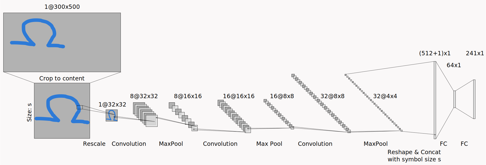

# Symbol Scribe

Tired of forgetting LaTeX symbols? Symbol Scribe is here to help! This lightweight browser and standalone application recognizes 152 of the most common LaTeX characters. Simply draw your desired symbol, and with a click, copy the corresponding LaTeX code directly into your document.

## How Symbol Scribe Works: The AI Under the Hood
### Model Architecture
Symbol Scribe uses a convolutional neural network (CNN) to identify your handwritten symbols. Here's a breakdown of the process:

1. Preprocessing: Your drawing is captured, automatically cropped to its content, and the height (h) and width (w) are recorded. The cropped image is then resized to a standardized 32x32 pixel format.

2. Convolutional Layers: The image passes through three convolutional layers (kernel size 3) with batch normalization. This transforms the image data from a single 32x32 layer (1@32x32) progressively to 8@32x32, 16@16x16, 16@8x8, 32@8x8, and finally 32 4x4 layers (32@4x4).

3. Flattening and Feature Concatination: The resulting 512 values are flattened and combined with the normalized height and width of the original drawing.

4. Fully Connected Layers: This combined data is fed into two fully connected layers. The first layer is normalized and regularized using dropout (1/3) to prevent overfitting.

### Training and Data Augmentation

The model was trained using a dataset of 11 to 13 hand-drawn images per symbol. To enhance the model's robustness and generalization, extensive data augmentation was used:

- Geometric Transformations: Shear distortion, rotation, and wave distortions.

- Noise Injection: Add random linear noise.

- Color Inversion

All combinations of these augmetation techniques were applied with random parameters. The default LaTeX representation of each symbol was also rendered and augmented using the same techniques.

This resulted in a training dataset of 209,792 images, or approximately 1,380 images per class.

The data was split into 80/20 for training and validation, and the model was trained for 100 epochs using the AdamW optimizer with a learning rate of 0.002.

## Performance
Symbol Scribe's performance was evaluated on a separate test set of 608 images (4 per class). The model achieved high accuracy:

- Top-1 Accuracy: Consistently achieved around 88% accuracy after just 12 epochs.

- Top-k Accuracy: Considering the similarity between some symbols (e.g., \Sigma and \Sum), we also analyzed top-k accuracy. Symbol Scribe achieves over 98% top-2 accuracy and nearly 100% top-5 accuracy, meaning the correct symbol is almost always within the top few predictions.

With that Symbol Scribe's can reliably recognize a wide range of LaTeX symbols, making it a valuable tool for anyone working with LaTeX documents. Maybe more symbols will be added later on.

